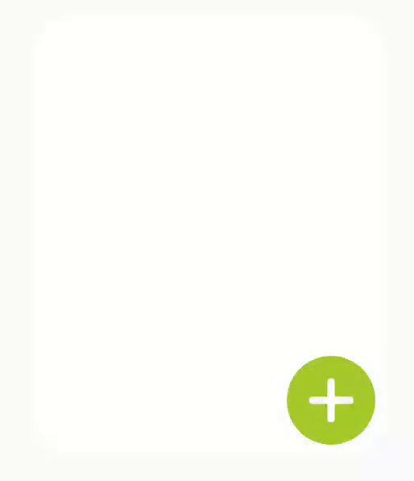

# QuantityPickerView
[](https://android-arsenal.com/details/1/8022)  

A View capable of increasing or decreasing a unit value with a toggle animation.  

 

#### Version 1.x
- **March, 2020** - View size will be equal to its state in, other words, expanded.size != closed.size
- **January, 2020** - QuantityPickerView 🥳

## Getting started
Include it into your project, for example, as a Gradle dependency:

```groovy
implementation 'com.github.guilhe:quantity-picker-view:${LATEST_VERSION}'
```
[](https://search.maven.org/artifact/com.github.guilhe/quantity-picker-view)  [](https://bintray.com/gdelgado/android/quantity-picker-view/_latestVersion)  

## Usage
Check out the __sample__ module where you can find a few examples of how to create it by `xml`.

Attributes accepted in xml:
```xml
<resources>
    <attr name="min" format="integer" />
    <attr name="max" format="integer" />
    <attr name="value" format="integer" />
    <attr name="textLabelSize" format="dimension" />
    <attr name="textLabelFormatter" format="string" />
    <attr name="textLabelFont" format="reference" />
    <attr name="backgroundColor" format="color" />
    <attr name="btnRemove" format="reference" />
    <attr name="btnAdd" format="reference" />
    <attr name="isOpen" format="boolean" />
    <attr name="autoToggle" format="boolean" />
    <attr name="rippleEnable" format="boolean" />
    <attr name="rippleColor" format="color" />
</resources>
```

Example:
```xml
com.github.guilhe.views.QuantityPickerView
    android:layout_width="match_parent"
    android:layout_height="wrap_content"
    app:textLabelFont="@font/permanentmarker_regular"
    app:textLabelFormatter="%s units."
    app:textLabelSize="14sp"/>
```

## Binaries
Binaries and dependency information for Gradle, Maven, Ivy and others can be found [here](https://search.maven.org/artifact/com.github.guilhe/quantity-picker-view).

<a href='https://bintray.com/gdelgado/android/quantity-picker-view?source=watch' alt='Get automatic notifications about new "quantity-picker-view" versions'></a>

## Dependencies
- [com.android.support:support-annotations](https://developer.android.com/topic/libraries/support-library/packages.html#annotations)
- [androidx.appcompat:appcompat](https://developer.android.com/jetpack/androidx/releases/appcompat) (for ResourcesCompat.getFont())

## Bugs and Feedback
For bugs, questions and discussions please use the [Github Issues](https://github.com/GuilhE/android-quantity-picker-view/issues).

 
## LICENSE
Copyright (c) 2020-present, GuilhE.

Licensed under the Apache License, Version 2.0 (the "License");
you may not use this file except in compliance with the License.
You may obtain a copy of the License at

<http://www.apache.org/licenses/LICENSE-2.0>

Unless required by applicable law or agreed to in writing, software
distributed under the License is distributed on an "AS IS" BASIS,
WITHOUT WARRANTIES OR CONDITIONS OF ANY KIND, either express or implied.
See the License for the specific language governing permissions and
limitations under the License.
